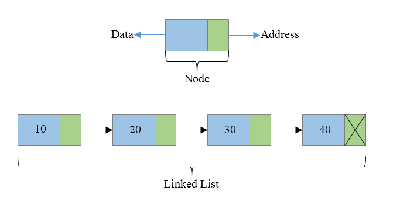

## List

리스트는 원소가 원소를 가리켜서 관리하는 자료구조이다. 

데이터가 추가되거나 삭제될 때 연결하는 정보만 바꾸면 쉽게 추가, 삭제가 된다.
저장 순서가 유지되고 중복이 허용된다.
배열처럼 index를 이용하여 접근한다.
하지만 배열과의 차이는 자료형의 크기가 고정이 아니고 데이터에 따라서 동적으로 늘어나는 가변형이다.

구현클래스로는
ArrayList, LinkedList, Vector, Stack 이 있다.

```java
import java.util.ArrayList;
import java.util.LinkedList;
import java.util.List;

public class Application {
    public static void main(String[] args) {
        List<String> arrayList = new ArrayList<>(); //arrayList

        list.add("a"); //요소를 추가하는 메서드
        list.add("b");
        list.add("c");

        list.get(0); //지정된 위치의 객체를 알려주는 메서드
        list.remove(0); //지정된 위치에 객체삭제 하고 삭제된 객체를 반환
        list.size(); //list의 사이즈를 알 수 있다.
        list.set(0, "c"); //지정된 위치에 객체를 저장한다
        list.indexOf("a"); //해당 객체의 인덱스를 알려준다.
        list.lastIndexOf(); //뒤에서 부터 확인

        List<String> arrayList = new LinkedList<>(); //linkedList

        list.add("a"); //요소를 추가하는 메서드
        list.add("b");
        list.add("c");

        list.get(0); //지정된 위치의 객체를 알려주는 메서드
        list.remove(0); //지정된 위치에 객체삭제 하고 삭제된 객체를 반환
        list.size(); //list의 사이즈를 알 수 있다.
        list.set(0, "c"); //지정된 위치에 객체를 저장한다
        list.indexOf("a"); //해당 객체의 인덱스를 알려준다.
        list.lastIndexOf(); //뒤에서 부터 확인
    }
}
```

### ArrayList

배열을 이용해 만든 리스트

데이터의 저장순서가 유지되고 중복을 허용한다.

단반향 포인터 구조여서 순차접근에 유리함 조회가 빠르다.

삽입 삭제는 느리다. 하지만 순차적인 삽입 삭제에는 강점이 있다.

### LinkedList


노드를 연결해서 리스트처럼 만든 컬렉션으로 배열과는 다르다.

데이터를 중간에 삭제 삭입 할때 빠르다.

자바에서는 양방향 포인터 구조로 이뤄져있다.

### Vector

ArrayList의 구형버전

동기화되어있어 스레드 세이프를 이룬다.

구버전 자바를 위해 남아 있지만 거의 사용하지 않는다.

### Stack

후입선출 구조

마지막 원소가 제일 먼저 나간다.

들어올때는 push(), 나갈때는 pop()을 사용

하지만 Stack 또한 Vector를 상속해서 잘 사용하지 않는다.

List에서는 ArrayList 와 LikedList 위주로 사용하자!

## Queue

선입 선출 구조로 이루어져있다.

큐에는 LinkedList, PriorityQueue, ArrayDeque 가 있음

### LinkedList 큐 구현
```java
import java.util.LinkedList;
import java.util.Queue;

public class Application {
public static void main(String[] args) {
Queue<String> queue = new LinkedList<>();
queue.offer("A");
queue.offer("B");
queue.offer("C"); //객체를 저장

        System.out.println(queue.poll());//객체를 꺼내서 반환
        System.out.println(queue.peek());//삭제 없이 읽기만한다.

        queue.remove();//remove는 동일
    }
}
```

### PriorityQueue 우선순위 큐

우선순위를 가지는 큐이다.

우선순위를 정해서 우선순위가 높은 순으로 큐에 저장한다.

네트워크나 스케줄링 알고리즘에서 쓰인다.

Comparable 인터페이스를 구현해서 우선순위를 정해줘야 한다.

### Deque
양쪽에서 넣고 빼고가 가능한 큐이다.
스택과 큐를 합쳐놔서 스택과 큐로 모두 사용할 수 있다.

### ArrayDeque
스택으로 사용할때 Stack클래스보다 빠르다. 대기열로 사용할때는 LinkedList보다 빠르다고 한다.

```java
import java.util.ArrayDeque;
import java.util.Deque;

public class Application {
    public static void main(String[] args) {
        Deque<Integer> deque = new ArrayDeque<>();
        deque.offerLast(2);
        deque.offerFirst(1);
        deque.offerFirst(3);
        deque.offerLast(4); // 이런식으로 앞뒤로 넣을 수 있음

        deque.pollFirst();
        deque.pollLast();
        deque.pollFirst();
        deque.pollLast(); //꺼내는것도 앞뒤로 가능
    }
}
```

## Set
데이터의 중복을 허용하지 않고 순서를 유지하지 않는 인터페이스이다.

순서가 없기때문에 인덱스로 값을 가져오는게 존재하지 않는다.

### HashSet
배열과 연결 노드를 결합한 형태
가장 빠른 임의 검색 접근 속도를 가진다.

추가, 삭제, 검색, 접근성이 모두 뛰어나다.

대신 순서를 전혀 예측할 수 없다.
```java
import java.util.HashSet;
import java.util.Set;

public class Application {
    public static void main(String[] args) {
        Set<Integer> set = new HashSet<>();
        set.add(32);
        set.add(5);
        set.add(17);
        set.add(8);
        set.add(19);
        set.add(32);

        System.out.println(set.size()); //중복 저장이 안되기 때문에 6개를 저장해도 사이즈는 5
        System.out.println(set); //넣은 순서가 보장안되고 출력 ex) [32, 17, 19, 5, 8]
    }
}
```

### LinkedHashSet

순서를 가지는 Set 자료

추가된 순서 또는 가장 최근에 접근한 순서대로 접근 가능

만일 중복을 제거하는 동시에 저장한 순서를 유지하고 싶다면, HashSet 대신 LinkedHashSet을 사용하면 된다.

```java
import java.util.LinkedHashSet;
import java.util.Set;

public class Application {
    public static void main(String[] args) {
        Set<Integer> set = new LinkedHashSet<>();
        set.add(32);
        set.add(5);
        set.add(17);
        set.add(8);
        set.add(19);
        set.add(32);

        System.out.println(set.size()); //중복 저장이 안되기 때문에 6개를 저장해도 사이즈는 5
        System.out.println(set); //add된 순서를 보장 출력 ex) [32, 5, 17, 8, 19]
    }
}
```
### TreeSet
이진 트리 형태로 자료를 저장

중복 허용하지 않고, 순서를 가지지 않는다.

하지만 트리를 사용하기 때문에 데이터를 저장하는 특징을 가지고 있다.
```java
import java.util.Set;
import java.util.TreeSet;

public class Application {
    public static void main(String[] args) {
        Set<Integer> set = new TreeSet<>();
        set.add(32);
        set.add(5);
        set.add(17);
        set.add(8);
        set.add(19);
        set.add(32);

        System.out.println(set.size()); //중복 저장이 안되기 때문에 6개를 저장해도 사이즈는 5
        System.out.println(set); //tree 구조를 이용해 정렬해서 출력 ex) [5, 8, 17, 19, 32]
    }
}
```